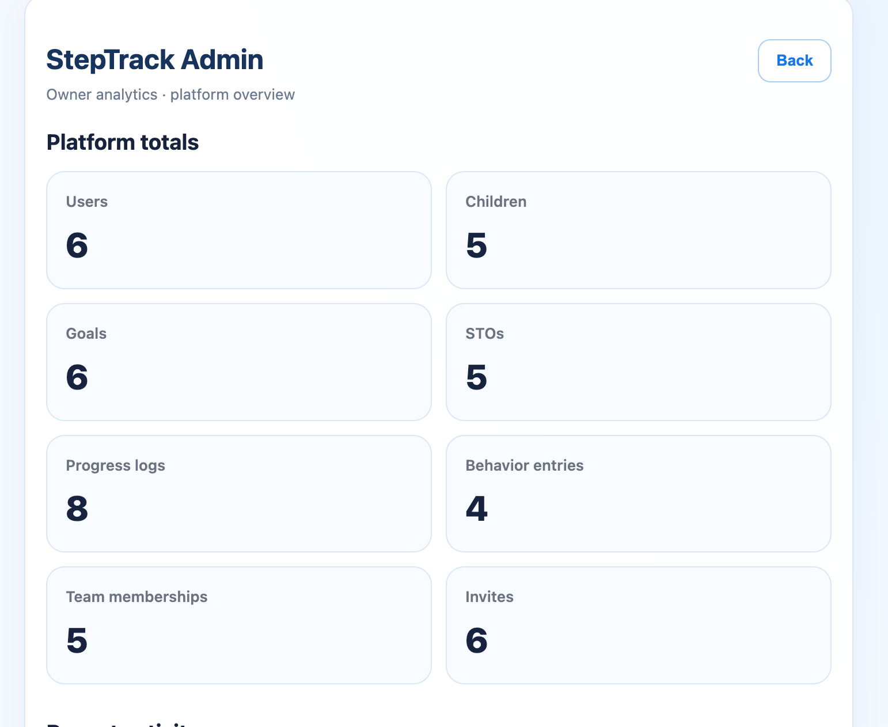
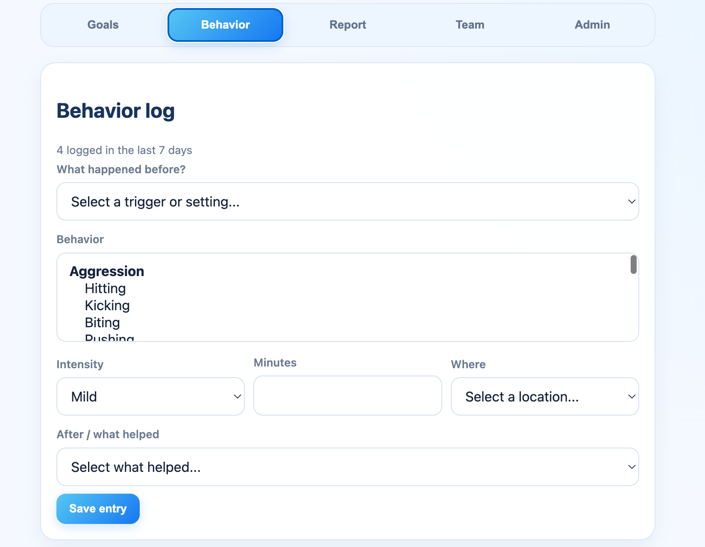
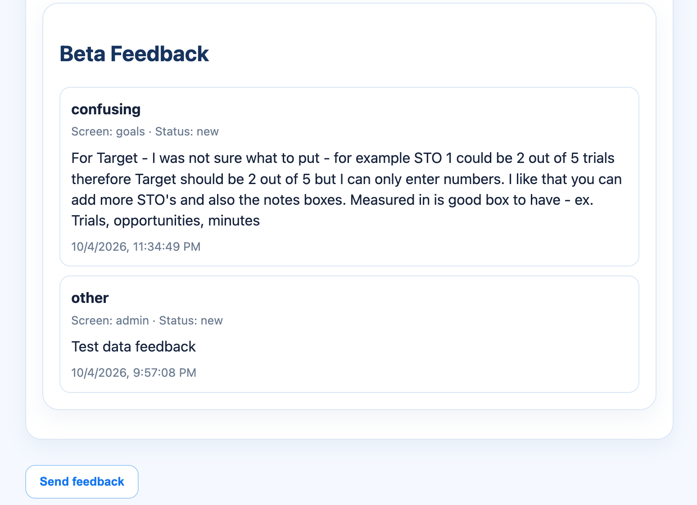
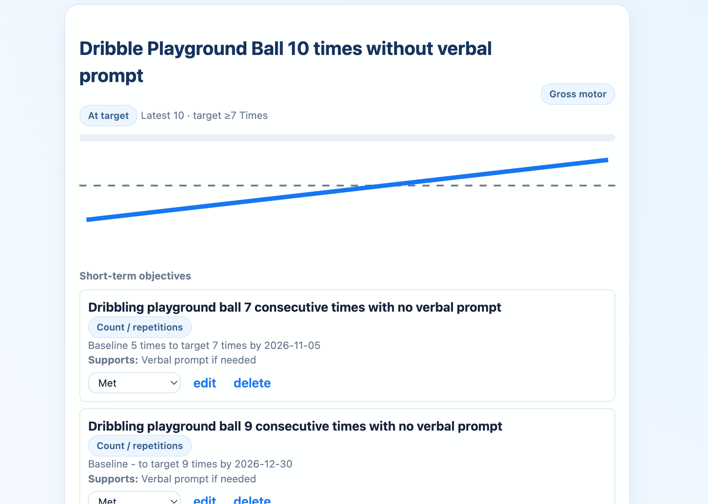

# StepTrack

StepTrack is a collaborative progress-tracking platform designed for parents, teachers, therapists, and aides supporting children with individualized goals.

The platform brings goals, short-term objectives, behavior tracking, progress data, reporting, team collaboration, and parent-controlled permissions into one shared application.

## Live Demo

https://steptrack-app.vercel.app

## Key Features

- Individual goal tracking
- Short-term objective (STO) tracking
- Flexible progress measurement
- Behavior data collection
- Progress reports
- Parent-controlled team access
- Role-based permissions
- Parent approval workflow for goal and STO changes
- Admin dashboard
- Beta feedback system
- Responsive/mobile-friendly interface

## User Roles

StepTrack supports:

- Parents
- Teachers
- Therapists
- Aides
- Application administrators

Permissions are role-based, with parents retaining final control over sensitive goal-management decisions.

## Security Architecture

Security and access control were built into StepTrack from the beginning.

- Supabase Row Level Security (RLS)
- Role-based authorization
- Parent-controlled collaborator permissions
- Protected parent access
- Authenticated-only RPC functions
- Explicit authorization checks in database functions
- Parent approval workflow for proposed goal and STO changes
- Administrative privileges separated from standard user access

## Tech Stack

- Next.js
- React
- JavaScript
- Supabase
- PostgreSQL
- Supabase Auth
- Vercel
- Git / GitHub

## Architecture

**Frontend:** Next.js / React

**Backend:** Supabase / PostgreSQL

**Authentication:** Supabase Auth

**Authorization:** PostgreSQL Row Level Security + secured RPC functions

**Deployment:** Vercel

## Project Status

StepTrack is currently in beta development.

Current work includes:

- Multi-role beta testing
- User feedback collection
- UX improvements
- Production email configuration
- Security and permission testing

## About the Project

StepTrack was created to solve a collaboration problem: parents, educators, therapists, and support staff often track a child's progress across different systems and environments.

StepTrack provides one shared location where approved team members can contribute progress data while maintaining clear roles, permissions, and parent oversight.

## Screenshots

### Admin Dashboard

### Behavior Tracking

### Built-in Beta Feedback

### Goal Progress & Short-Term Objectives

